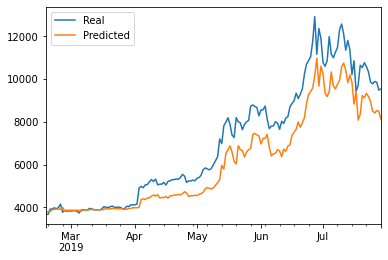

# Deep Learning Homework

## Background

This project aims to use LTSM RNNs to forecast Bitcoin closing prices. One model will use the FNG indicators to predict the closing price while the second model will use a window of closing prices to predict the closing price.

The [Crypto Fear and Greed Index (FNG)](https://alternative.me/crypto/fear-and-greed-index/) is a sentiment indicator.

The files include:

[Closing Price Predictor](lstm_closing_predictor.ipynb)

[FNG Predictor](lstm_fng_predictor.ipynb)

- - -

## Summary of Analysis

#### LSTM RNNs

Two LSTM RNN models were built (both use 70% of the data for training and 30% of the data for testing):

1. Closing Price Model: use a rolling 10-day window of Bitcoin closing prices to predict the 11th day closing price

2. FNG Value Model: uses a rolling 10-day window of Bitcoin fear and greed index values to predict the 11th day closing price

#### Model Performance

- Closing Price Model overall has a lower loss

- Closing Price Model tracks the actual values better over time

- 1-day window size works best for both models
    - Closing Price Model: 1D Window Loss of 0.0135 vs. 10D Window Loss of 0.0444
    
    1-day Window Closing Price:
    
    
    - FNG Model: 1D Window Loss of 0.0942 vs. 10D Window Loss of 0.1088
    
    1-day Window FNG Value:
    